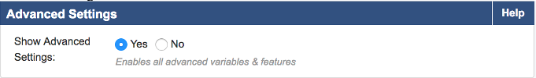

// Add steps as necessary for accessing the software, post-configuration, and testing. Don’t include full usage instructions for your software, but add links to your product documentation for that information.
//Should any sections not be applicable, remove them

== Test the deployment
// If steps are required to test the deployment, add them here. If not, remove the heading
* Note the Public IP address of the newly deployed Barracuda CloudGen WAF. Open the browser and enter the noted IP with port 8000 for HTTP: http://IP-Address:8000. If the license agreement page is displayed then scroll to the bottom and click Accept.

* At the Admin login page use “admin” as the username and the instance-ID as the password. NOTE: each WAF will have its own admin password so be sure to match the instance-ID with the instance’s elastic IP address. On the CloudGen WAF GUI go to Advanced, System Configuration and set Show Advanced Settings to Yes. Click the green Save button.

[Advanced Settings]

*  On the CloudGen WAF GUI go to Basic, Services. You should see a WAF service matching the WAFServiceName and WAFServicePort parameters from the CFT stack. If you specified an application server port and IP you will see it listed under the service. Example:

{width="5.99in",height="3.69in"}

* The application server IP address and port can be changed if needed. You may also specify a hostname instead of IP address. Under the column Actions click the Edit link for the application server. In the identifier drop-down select IP Address or Hostname and then specify the corresponding value. Here is an example using an internal load balancer DNS name:

{width="4.08in",height="1.76in"}

* You will need a working application server (i.e. “origin server”) in order to fully test the WAF functionality. For simple testing use HTTP on port 80. Browse to the DNS name of the load balancer created by the stack deployment. In the AWS console navigate to EC2 > Load Balancers and select the load balancer. On the Description tab locate the DNS name and click the copy icon to copy the load balancer DNS name to the clipboard. Open a new browser tab and paste the DNS name into the address bar.

* View website access activity in the WAF UI. Navigate to BASIC > Access Logs to see all web requests that have passed through the WAF. Navigate to BASIC > Web Firewall Logs to see all requests that have been blocked, cloaked, or logged as suspicious. Initially the WAF is in passive mode, so bad traffic is marked as LOGGED.

* Additional information on configuring the WAF can be found at Securing HTTP/HTTPS Traffic

== Best practices for using {partner-product-short-name} on AWS
// Provide post-deployment best practices for using the technology on AWS, including considerations such as migrating data, backups, ensuring high performance, high availability, etc. Link to software documentation for detailed information.

*Cluster for High Availability (HA) and redundancy*

Due to the 24/7 nature of web traffic, it is important that any
deployments in line with the data path have added redundancy. The
Barracuda Web Application Firewalls configured in HA clusters will
automatically synchronize security and network configurations between
the clusters to provide seamless failover in response to disruptions.
This is achieved by creating an autoscaling group of WAF clusters. IF
you are using the BYOL template you will need licenses for the max
number of instances you anticipate on scaling to. For more information
on clustering, see https://campus.barracuda.com/doc/4259911/[High
Availability].

== Security
// Provide post-deployment best practices for using the technology on AWS, including considerations such as migrating data, backups, ensuring high performance, high availability, etc. Link to software documentation for detailed information.

The Barracuda Web Application Firewall provides features to implement
user authentication and access control. You can create a virtual private
network (VPN) tunnel to control user access to websites. The user-access
features allow you to specify who can access your websites and what
access privileges each user has. By combining these with SSL encryption,
you can create a secure VPN tunnel to your websites.

Authentication can be implemented only for HTTP or HTTPS services. The
authentication process requires users to provide a valid name and
password to gain access. A validated user has qualified access to the
website; that is, the data and services this user can access depend on
his or her authorization privileges.

