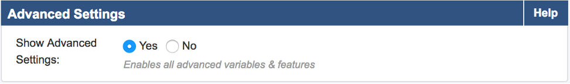
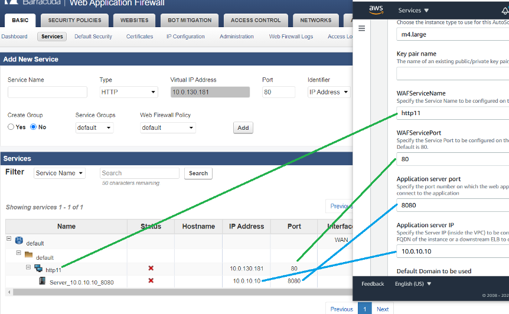
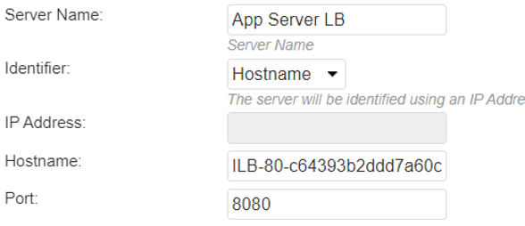

// Add steps as necessary for accessing the software, post-configuration, and testing. Don’t include full usage instructions for your software, but add links to your product documentation for that information.
//Should any sections not be applicable, remove them

== Test the deployment
// If steps are required to test the deployment, add them here. If not, remove the heading
* Note the public IP address of the new {partner-product-short-name} deployment. Open a browser and enter the IP address with port 8000 for HTTP (example: http://IP-Address:8000). If the license agreement page appears, scroll to the bottom and choose *Accept*.

* On the administrator login page, use `admin` as the user name and the instance-ID as the password. 

NOTE: Each WAF has its own admin password, so be sure to match the instance-ID with the instance’s elastic IP address. On the {partner-product-short-name} UI, go to *Advanced > System Configuration* and set the *Show Advanced Settings* option to *Yes*. Choose the green *Save* button.

* On the {partner-product-short-name} UI, navigate to *Basic > Services*. You should see a WAF service matching the `WAFServiceName` and `WAFServicePort` parameters from the CloudFormation stack. If you specified an application server port and IP address, you will see them listed as a service:

* You can change the application server IP address and port, if needed. You can also specify a host name instead of an IP address. Under the *Actions* column, choose the *Edit* link for the application server. In the identifier drop-down list, select *IP Address* or *Hostname* and then specify the corresponding value. Here is an example using an internal load balancer DNS name:

* You must have a working application server (i.e., origin server) to fully test the WAF functionality. For simple testing, use HTTP on port 80. Browse to the DNS name of the load balancer created by the stack deployment. In the AWS Console, navigate to *EC2 > Load Balancers* and select the load balancer. On the *Description* tab, locate the DNS name and select the copy icon to copy the load balancer DNS name to the clipboard. Open a new browser tab and paste the DNS name into the address bar.

* View website access activity in the WAF UI. Navigate to *BASIC > Access Logs* to see the web requests that have passed through the WAF. Navigate to *BASIC > Web Firewall Logs* to see requests that have been blocked, cloaked, or logged as suspicious. Initially the WAF is in passive mode, so bad traffic is marked as LOGGED.

* Additional information on configuring the WAF can be found at Securing HTTP/HTTPS Traffic

== Configure HA clusters for seamless failover 
// Provide post-deployment best practices for using the technology on AWS, including considerations such as migrating data, backups, ensuring high performance, high availability, etc. Link to software documentation for detailed information.

Due to the 24/7 nature of web traffic, deployments that are in line with the data path should have added redundancy. The Barracuda WAFs configured in high availability (HA) clusters automatically synchronize security and network configurations between the clusters to provide seamless failover in response to disruptions. This occurs by creating an Auto Scaling group of WAF clusters. If you are using the Buy Your Own License (BYOL) template, you will need licenses for the maximum number of instances to which you will scale. For more information
on clustering, see https://campus.barracuda.com/doc/4259911/[High Availability].

== Configure security
// Provide post-deployment best practices for using the technology on AWS, including considerations such as migrating data, backups, ensuring high performance, high availability, etc. Link to software documentation for detailed information.

The Barracuda WAF provides features to implement user authentication and access control. You can create a VPN tunnel to control user access to websites. The user-access features allow you to specify who can access your websites and what access privileges each user has. By combining these with SSL encryption, you can create a secure VPN tunnel to your websites.

You can implement authentication only for HTTP or HTTPS services. The authentication process requires users to provide a valid name and password to gain access. A validated user has qualified access to the website; the data and services this user can access depend on his or her authorization privileges.